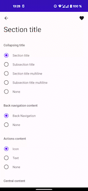

# Jetpack Compose custom toolbar implementation sample

Not a library yet! Just a sample project

## Features
- Collapsing title behavior with smooth multiline title support
- Slots API for customizing parts of toolbar

Scroll behavior based on implementation from [compose.material3](https://developer.android.com/jetpack/androidx/releases/compose-material3)

More details about implementation [in this video](https://www.youtube.com/watch?v=FWxwJaG8PNY)

## Demo

